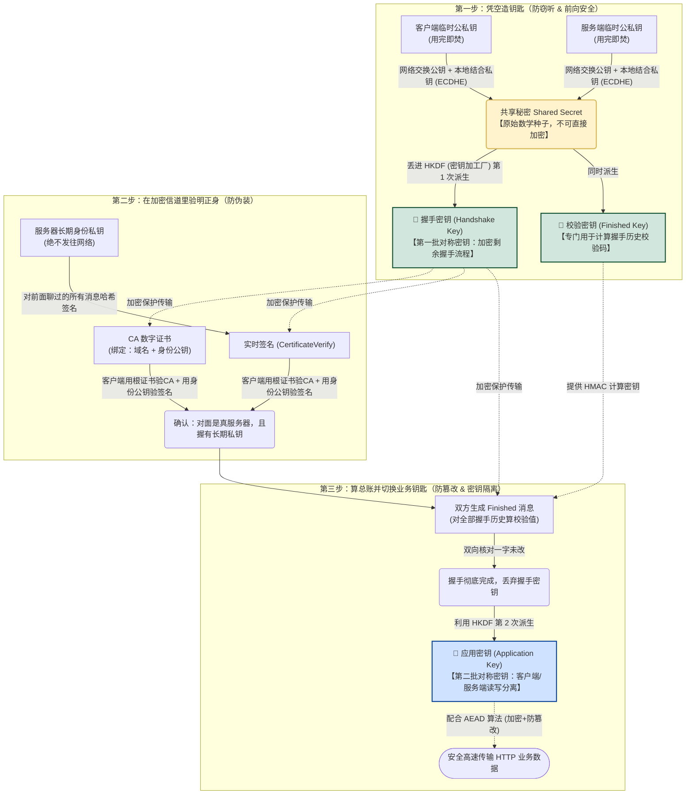

---
{"dg-publish":true,"permalink":"/CS工程体系/计算机网络/TLS协议/因果推导图 （无时序）/","dg-note-properties":{}}
---

```mermaid

flowchart TD

subgraph 痛点1_防窃听与前向安全 ["第一步：凭空造钥匙（防窃听 & 前向安全）"]

A1["客户端临时公私钥<br/>(用完即焚)"] & A2["服务端临时公私钥<br/>(用完即焚)"]

-->|"网络交换公钥 + 本地结合私钥 (ECDHE)"| B("共享秘密 Shared Secret<br/>【原始数学种子，不可直接加密】")

B -->|"丢进 HKDF (密钥加工厂) 第 1 次派生"| C1["🔑 握手密钥 (Handshake Key)<br/>【第一批对称密钥：加密剩余握手流程】"]

B -->|"同时派生"| C2["🔑 校验密钥 (Finished Key)<br/>【专门用于计算握手历史校验码】"]

end

  

subgraph 痛点2_防中间人伪装 ["第二步：在加密信道里验明正身（防伪装）"]

D1["CA 数字证书<br/>(绑定：域名 + 身份公钥)"]

D2["服务器长期身份私钥<br/>(绝不发往网络)"] -->|对前面聊过的所有消息哈希签名| D3["实时签名 (CertificateVerify)"]

C1 -.->|"加密保护传输"| D1 & D3

D1 & D3 -->|"客户端用根证书验CA + 用身份公钥验签名"| E("确认：对面是真服务器，且握有长期私钥")

end

  

subgraph 痛点3_防篡改与业务隔离 ["第三步：算总账并切换业务钥匙（防篡改 & 密钥隔离）"]

E --> F["双方生成 Finished 消息<br/>(对全部握手历史算校验值)"]

C2 -.->|"提供 HMAC 计算密钥"| F

C1 -.->|"加密保护传输"| F

F -->|"双向核对一字未改"| G("握手彻底完成，丢弃握手密钥")

G -->|"利用 HKDF 第 2 次派生"| H["🔑 应用密钥 (Application Key)<br/>【第二批对称密钥：客户端/服务端读写分离】"]

H -.->|"配合 AEAD 算法 (加密+防篡改)"| I(["安全高速传输 HTTP 业务数据"])

end

  

style B fill:#fff3cd,stroke:#d6b656,stroke-width:2px

style C1 fill:#d1e7dd,stroke:#0f5132,stroke-width:2px

style C2 fill:#d1e7dd,stroke:#0f5132,stroke-width:2px

style H fill:#cfe2ff,stroke:#084298,stroke-width:2px
```

